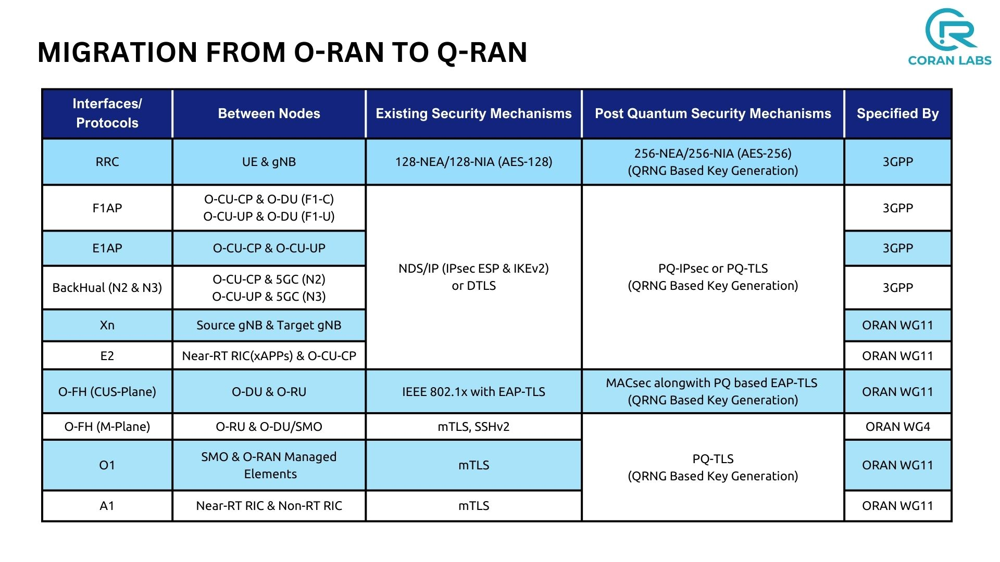
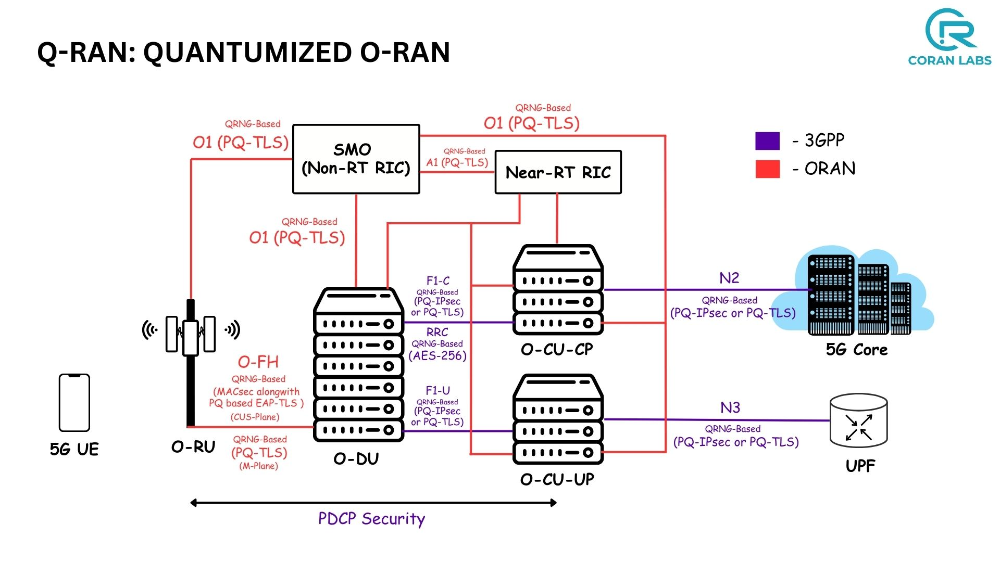

<table style="border-collapse: collapse; border: none;">
  <tr style="border-collapse: collapse; border: none;">
    <td style="border-collapse: collapse; border: none;">
      <a href="http://www.coranlabs.com/">
         
         </img>
      </a>
    </td>
    <td style="border-collapse: collapse; border: none; vertical-align: center;">
      <b><h1>Q-RAN: Quantumized O-RAN  </h1></b>
      <b><h2>Post-Quantum O-RAN using Post-Quantum Cryptography & QRNG</h2></b>
    </td>
  </tr>
</table>

## TABLE OF CONTENTS
1. [Introduction](#introduction)
2. [Need for Q-RAN](#need-for-qran)
   - [Problem Statement](#problem-statement)
   - [Solution](#solution)
3. [Migration from Classical O-RAN to Post-Quantum O-RAN](#migration-from-classical-o-ran-to-post-quantum-o-ran)

## Introduction

**Q-RAN** integrates **Post-Quantum Cryptography (PQC)** and **Quantum Random Number Generators (QRNG)** into O-RAN, revolutionizing network security and resilience against quantum threats. Discover how Q-RAN can future-proof telecommunications, ensuring unparalleled security, privacy, and performance in the quantum era.

## Need for QRAN?

#### Problem Statement:

O-RAN, or Open RAN, currently relies on classical cryptographic techniques for security. However, these traditional encryption methods are becoming increasingly vulnerable to quantum threats. Quantum computers, with their ability to solve complex problems exponentially faster, pose a significant risk to classical cryptographic algorithms. As quantum computing advances, it will become possible to break traditional cryptographic methods, exposing classical O-RAN to substantial security risks.

#### Solution:

To secure O-RAN against quantum threats, it is essential to migrate to a Post-Quantum O-RAN (Q-RAN). This migration involves adopting post-quantum cryptographic algorithms designed to withstand the capabilities of quantum computers. Additionally, the generation of truly random numbers is crucial to ensure cryptographic keys remain safe from quantum attacks, achievable through Quantum Random Number Generators (QRNG).

Q-RAN addresses these needs by integrating the following post-quantum techniques:
* `ML-KEM`: Module-Lattice-Based Key-Encapsulation Mechanism, ensures secure key exchange and protection against quantum attacks, utilizing lattice-based cryptography for strong security foundations.

* `ML-DSA`: Module-Lattice-Based Digital Signature Algorithm, a lattice-based digital signature scheme offering strong security guarantees against quantum computing threats.

* `QRNG seeds`: Utilizes Quantum Random Number Generators to produce truly random seeds, enhancing key security.

* `PQ-TLS`: Post-Quantum Transport Layer Security to secure communication channels.

* `AES256`: Advanced Encryption Standard with 256-bit keys to ensure robust encryption.

* `PQ-IPSec`: Post-Quantum IPSec for securing Internet Protocol Security communications.

* `PQ-DTLS`: Post-Quantum Datagram Transport Layer Security for securing datagram communications.

## Migration from Classical O-RAN to Post-Quantum O-RAN

One of the best things about O-RAN is its extensive use of different interfaces and protocols, fostering innovation and flexibility. However, this diversity also introduces complexity in securing these various components. Migration to Post-Quantum O-RAN using Q-RAN addresses these challenges by providing a comprehensive security framework designed to withstand quantum threats.

By integrating post-quantum cryptography and QRNGs, Q-RAN ensures that O-RAN is fortified against the quantum threats of the future. Embrace Q-RAN today to secure your network for tomorrow's quantum era.

> Q-RAN has been tested with [QORE](https://github.com/coranlabs/QORE)

