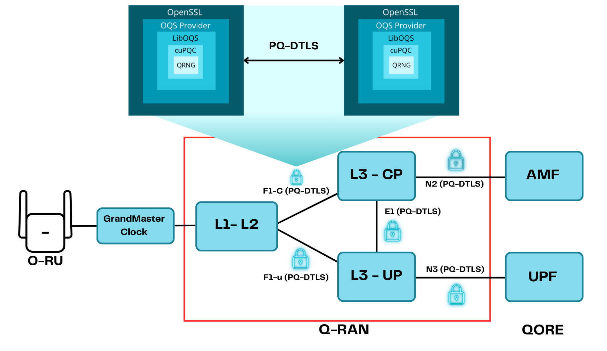
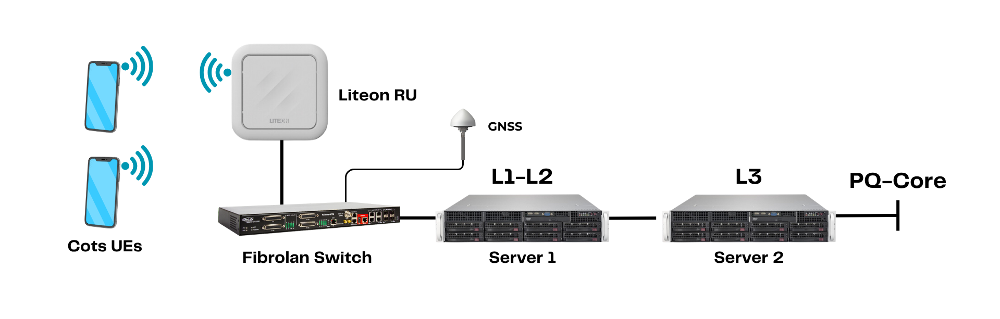

<table>
  <tr>
    <td></td>
    <td><h1 style="margin-left: 10px;">Q-RAN: Quantum-Resilient O-RAN Architecture</h1></td>
  </tr>
</table>

**Q-RAN** is a quantum-resistant security framework for 5G Open RAN (O-RAN) architecture, implementing NIST-standardized Post-Quantum Cryptography (PQC) across all critical RAN interfaces. It secures fronthaul, midhaul, and backhaul communications using ML-KEM, ML-DSA, and Quantum Random Number Generators (QRNG) to protect against current and future quantum computing threats.

---

## Abstract

As quantum computing capabilities advance, traditional cryptographic protocols securing Open Radio Access Network (O-RAN) architectures face unprecedented vulnerabilities. The disaggregated nature of O-RAN, while enabling flexibility and innovation, expands the attack surface and makes quantum threats even more critical. Q-RAN addresses this challenge by introducing a comprehensive quantum-resistant security framework that deploys NIST-standardized Post-Quantum Cryptography across all O-RAN interfaces.

Q-RAN integrates **ML-KEM (Module-Lattice Key Encapsulation Mechanism)** and **ML-DSA (Module-Lattice Digital Signature Algorithm)** with **Quantum Random Number Generators (QRNG)**, implementing post-quantum protocols including **PQ-IPsec**, **PQ-DTLS**, and **PQ-mTLS** across F1, E1, E2, N2, and N3 interfaces. The framework includes a centralized Post-Quantum Certificate Authority (PQ-CA) integrated within the Service Management and Orchestration (SMO) framework, ensuring end-to-end quantum security from Radio Unit (RU) to Core Network.

Built on the OpenAirInterface5G stack with support for real radios (7.2 split) and real-time execution, Q-RAN provides a production-ready, future-proof solution for securing next-generation wireless networks against "Harvest Now, Decrypt Later" (HNDL) attacks.

---

## Research Publication

This work is documented in our research paper:

**"Q-RAN: Quantum-Resilient O-RAN Architecture"**  
*Vipin Rathi, Lakshya Chopra, Madhav Agarwal, Nitin Rajput, Kriish Sharma, Sushant Mundepi, Shivam Gangwar, Rudraksh Rawal, Jishan*

arXiv: [https://arxiv.org/abs/2510.19968](https://arxiv.org/abs/2510.19968)  
PDF: [https://arxiv.org/pdf/2510.19968](https://arxiv.org/pdf/2510.19968)  
HTML: [https://arxiv.org/html/2510.19968](https://arxiv.org/html/2510.19968)

**Submitted**: October 22, 2025 | **Pages**: 23 | **Subjects**: Cryptography and Security, Distributed/Parallel Computing, Networking and Internet Architecture

If you use Q-RAN in your research or implementation, please cite our paper:

```bibtex
@article{qran2024,
  title={Q-RAN: Quantum-Resilient O-RAN Architecture},
  author={Rathi, Vipin and Chopra, Lakshya and Agarwal, Madhav and Rajput, Nitin and Sharma, Kriish and Mundepi, Sushant and Gangwar, Shivam and Rawal, Rudraksh and Jishan},
  journal={arXiv preprint arXiv:2510.19968},
  year={2024},
  url={https://arxiv.org/abs/2510.19968}
}
```

---

## Table of Contents

1. [Overview](#overview)
2. [The Quantum Threat to O-RAN](#the-quantum-threat-to-o-ran)
3. [Q-RAN Architecture](#q-ran-architecture)
4. [Post-Quantum Cryptographic Primitives](#post-quantum-cryptographic-primitives)
5. [Security Protocols](#security-protocols)
6. [O-RAN Interface Security](#o-ran-interface-security)
7. [Post-Quantum Certificate Authority](#post-quantum-certificate-authority)
8. [Performance Evaluation](#performance-evaluation)
9. [Test Bed](#test-bed)
10. [Getting Started](#getting-started)
11. [Technologies Used](#technologies-used)
12. [Roadmap](#roadmap)
13. [Documentation](#documentation)
14. [Publications and Media](#publications-and-media)
15. [License](#license)
16. [Contact](#contact)

---

## Overview

**Q-RAN (Quantum-Resilient O-RAN)** is a post-quantum secure upgrade for the 5G Open RAN architecture, designed to protect against quantum computing attacks on disaggregated radio access networks.

### Key Features

- **Post-Quantum Safe**: Uses NIST-standardized ML-KEM (FIPS 203) and ML-DSA (FIPS 204)
- **Comprehensive Coverage**: Secures all O-RAN interfaces (F1, E1, E2, N2, N3)
- **CU-DU Split Architecture**: Supports real radios with 7.2 split (fronthaul)
- **Real-Time Execution**: Runs on Linux servers with hardware-synced timing
- **Hybrid Mode**: Supports hybrid PQ + classical crypto for migration
- **QRNG Integration**: True quantum entropy for cryptographic key generation
- **Enterprise Logging**: Advanced logging mechanism with comprehensive log file generation
- **Production-Ready**: Built for research, testing, and future-secure telecom deployments

**Check out the [Release Notes](docs/release-notes.md)** for a full breakdown of features, fixes, and updates.

---

## The Quantum Threat to O-RAN

### Quantum Computing Vulnerabilities

Modern O-RAN architectures rely on classical cryptographic protocols (RSA, ECDH, ECDSA) that will be broken by quantum computers running **Shor's algorithm**. The disaggregated nature of O-RAN creates unique challenges:

- **Expanded Attack Surface**: Multiple interfaces (F1, E1, E2, N2, N3) require independent security
- **Harvest Now, Decrypt Later (HNDL)**: Adversaries capture encrypted RAN traffic for future quantum decryption
- **Critical Infrastructure**: RAN handles sensitive subscriber data, location information, and authentication
- **Long Deployment Cycles**: Radio equipment deployed today will operate for 10-20 years

### Why Q-RAN is Essential

- **3GPP Standards Evolution**: 3GPP SA3 is actively developing PQC specifications for RAN
- **O-RAN Alliance**: Working groups addressing quantum security in open architectures
- **NIST PQC Standardization**: FIPS 203, 204, 205 provide standardized quantum-safe algorithms
- **Regulatory Pressure**: Government mandates for quantum-resistant telecommunications

---

## Q-RAN Architecture



### Architectural Components

**Radio Unit (RU)**
- Fronthaul interface (7.2 split) secured with PQ-DTLS
- Supports commercial O-RU (LiteON) and open-source implementations
- Hardware-synced timing via PTP/SyncE

**Distributed Unit (DU)**
- F1 interface to CU secured with PQ-DTLS
- Real-time L1/L2 processing with quantum-safe key exchange
- ML-KEM-based session establishment

**Central Unit (CU)**
- CU-CP: Control plane with PQ-DTLS for F1-C and E1
- CU-UP: User plane with PQ-IPsec for N3
- N2 interface to AMF secured with PQ-DTLS

**Service Management and Orchestration (SMO)**
- Centralized Post-Quantum Certificate Authority (PQ-CA)
- O1 management interface with PQ-mTLS
- E2 interface to RIC secured with PQ-IPsec
- Quantum Random Number Generator integration

**Core Network Integration**
- Seamless integration with [QORE: Post-Quantum 5G Core](https://github.com/CoranLabs/QORE)
- End-to-end quantum security from RAN to Core to UE

---

## Post-Quantum Cryptographic Primitives

Q-RAN implements NIST-standardized lattice-based cryptography:

### Key Encapsulation Mechanisms

**ML-KEM (Module-Lattice-Based Key Encapsulation Mechanism)**
- **Standard**: FIPS 203
- **Algorithm**: Based on Module Learning with Errors (MLWE)
- **Security Levels**:
  - ML-KEM-512 (AES-128 equivalent)
  - ML-KEM-768 (AES-192 equivalent) - **Recommended for Q-RAN**
  - ML-KEM-1024 (AES-256 equivalent)
- **Use Cases**: DTLS key exchange, IPsec IKEv2, mTLS handshakes
- **Implementation**: liboqs, wolfSSL, OpenSSL integration

### Digital Signatures

**ML-DSA (Module-Lattice-Based Digital Signature Algorithm)**
- **Standard**: FIPS 204
- **Algorithm**: Based on Module Short Integer Solution (MSIS)
- **Security Levels**:
  - ML-DSA-44 (AES-128 equivalent)
  - ML-DSA-65 (AES-192 equivalent) - **Recommended for Q-RAN**
  - ML-DSA-87 (AES-256 equivalent)
- **Use Cases**: Certificate signatures, authentication, message integrity
- **Implementation**: liboqs, wolfSSL, OpenSSL integration

### Hybrid Cryptography

Q-RAN supports **hybrid mode** for backward compatibility and gradual migration:

| **Mode** | **Key Exchange** | **Signatures** |
|----------|------------------|----------------|
| **Pure PQC** | ML-KEM-768 | ML-DSA-65 |
| **Hybrid PQC** | X25519-MLKEM768 | Ed448-ML-DSA-65 |

**Hybrid Benefits**:
- Maintains security even if PQC is broken
- Enables interoperability with classical RAN components
- Smooth migration path from classical to pure PQC

---

## Security Protocols

### PQ-DTLS 1.3 (Post-Quantum Datagram TLS)

Quantum-resistant DTLS for RAN control plane interfaces:

- **Key Exchange**: ML-KEM-768 (pure) or X25519-MLKEM768 (hybrid)
- **Signatures**: ML-DSA-65 (pure) or Ed448-ML-DSA-65 (hybrid)
- **Use Cases**: F1 interface (CU-DU), E1 interface (CU-CP to CU-UP), N2 interface (AMF-CU)
- **Transport**: UDP with handshake fragmentation support
- **Performance**: Low latency suitable for real-time RAN timing requirements

### PQ-IPsec (Post-Quantum IPsec)

Quantum-safe user plane encryption:

- **IKEv2**: ML-KEM for key establishment
- **ESP**: AES-256-GCM/CTR/CCM encryption
- **Use Cases**: N3 interface (CU-UP to UPF), E2 interface (RIC to RAN)
- **Hardware Acceleration**: GPU offloading planned for Release 2.0

### PQ-mTLS 1.3 (Post-Quantum Mutual TLS)

Quantum-resistant TLS for management interfaces:

- **Key Exchange**: ML-KEM-768
- **Signatures**: ML-DSA-65
- **Use Cases**: O1 management interface (SMO to RAN), OAuth 2.0 authentication
- **Transport**: TCP with HTTP/2 support

---

## O-RAN Interface Security

### Classical vs. Post-Quantum Security

| **Interface** | **Protocol** | **Classical Crypto** | **Q-RAN (Post-Quantum)** | **Status** |
|---------------|--------------|----------------------|--------------------------|------------|
| **Fronthaul (7.2)** | eCPRI/C-Plane | No encryption | PQ-DTLS 1.3 | Completed |
| **F1-C** | SCTP | DTLS 1.2 (ECDHE) | PQ-DTLS 1.3 (ML-KEM) | Completed |
| **F1-U** | GTP-U | IPsec (IKEv2 + DH) | PQ-IPsec (IKEv2 + ML-KEM) | In Progress |
| **E1** | SCTP | DTLS 1.2 (ECDHE) | PQ-DTLS 1.3 (ML-KEM) | Completed |
| **E2** | SCTP | IPsec (optional) | PQ-IPsec (ML-KEM) | Planned |
| **N2** | SCTP | DTLS 1.2 | PQ-DTLS 1.3 | Completed |
| **N3** | GTP-U | IPsec | PQ-IPsec | Completed |
| **O1** | HTTP/2 | mTLS (RSA/ECDSA) | PQ-mTLS (ML-DSA) | Completed |

### Fronthaul Security (7.2 Split)

**Challenge**: Fronthaul requires ultra-low latency (<250 μs) and high throughput (10+ Gbps)

**Q-RAN Solution**:
- PQ-DTLS for C-Plane (control) with optimized handshake
- Hardware timestamping for precise synchronization
- Upcoming GPU acceleration for U-Plane (user data)

---

## Post-Quantum Certificate Authority

Q-RAN includes a centralized **PQ-CA** integrated within the SMO framework:

### PQ-PKI Architecture

- **Root CA**: ML-DSA-87 signatures (long-term security)
- **Intermediate CAs**: Per-operator hierarchy
- **End-Entity Certificates**: ML-DSA-65 for RAN components (RU, DU, CU)
- **Certificate Revocation**: CRL and OCSP with quantum-safe signatures
- **Lifecycle Management**: Automated issuance, renewal, and revocation

### Certificate Distribution

- **Bootstrap**: Secure initial provisioning of certificates to RAN components
- **Renewal**: Automated certificate rotation before expiry
- **Revocation**: Real-time distribution of revocation lists

---

## Performance Evaluation

### Cryptographic Operation Performance

Based on experimental validation documented in the research paper:

| **Operation** | **Algorithm** | **Performance** |
|---------------|---------------|-----------------|
| Key Encapsulation | ML-KEM-768 | 236,000 ops/s |
| Decapsulation | ML-KEM-768 | 245,000 ops/s |
| Signature Generation | ML-DSA-65 | 45,000 ops/s |
| Signature Verification | ML-DSA-65 | 1,150,000 ops/s |

### DTLS Handshake Performance

| **Protocol** | **Handshake Time** | **Overhead** |
|--------------|-------------------|--------------|
| Classical DTLS 1.2 | 12-18 ms | Baseline |
| PQ-DTLS 1.3 (ML-KEM-768) | 18-25 ms | +6-7 ms |
| Hybrid PQ-DTLS | 20-28 ms | +8-10 ms |

### Real-Time Performance

- **L1 Processing**: Meets 1ms TTI requirements with PQ-DTLS overhead
- **F1-C Latency**: <30ms handshake suitable for RRC procedures
- **Fronthaul Sync**: Hardware timestamping maintains <1μs accuracy

### Symmetric Encryption

Q-RAN uses AES-256 for enhanced quantum resistance:

- **AES-256-GCM**: Authenticated encryption for IPsec ESP
- **AES-256-CTR**: High-performance streaming cipher
- **AES-256-CCM**: Combined CTR + CBC-MAC for constrained devices

---

## Test Bed



### Testbed Components

| **Layer** | **Component** | **Details** |
|-----------|---------------|-------------|
| **User Equipment (UE)** | Commercial Off-the-Shelf (COTS) UE | Quectel Modems, smartphones |
| **Radio Unit (RU)** | LiteON O-RU | Commercial O-RAN Radio Unit (7.2 split) |
| **Distributed Unit (DU)** | Q-RAN DU | OpenAirInterface5G with PQ-DTLS |
| **Central Unit (CU)** | Q-RAN CU | CU-CP and CU-UP with PQ security |
| **Grandmaster Clock** | Fibrolan Falcon RX | PTP grandmaster for fronthaul sync |
| **Core Network** | [QORE](https://github.com/CoranLabs/QORE) | Post-Quantum 5G Core (Free5GC variant) |

### Deployment Configuration

- **Server Hardware**: Intel Xeon processors, 32GB+ RAM
- **Real-Time Kernel**: Linux RT for deterministic L1 processing
- **Network**: 10GbE for fronthaul, 1GbE for backhaul
- **Synchronization**: IEEE 1588 PTP with hardware timestamping

---

## Logs Demo

<p align="center">
  
</p>

> Real-time PQ handshake and DTLS logs from live Q-RAN deployment with commercial radios

**Enterprise Logging Features**:
- Real-time cryptographic handshake visualization
- Per-interface security event tracking
- Certificate validation logging
- Performance metrics collection

---

## Getting Started

### Prerequisites

- **Operating System**: Ubuntu 20.04/22.04 LTS with real-time kernel
- **Hardware**: Intel Xeon or AMD EPYC processor, 32GB+ RAM
- **O-RU**: Compatible 7.2 split radio (LiteON or equivalent)
- **PTP Grandmaster**: For fronthaul synchronization
- **Core Network**: QORE or compatible 5G Core

### Quick Start

```bash
# Clone the repository
git clone https://github.com/coranlabs/Q-RAN.git
cd Q-RAN

# Build Q-RAN with PQ support
./build_aria.sh

# Configure interfaces
# Edit configs/cu_config.yaml and configs/du_config.yaml

# Start CU
./CU_QRAN_start

# Start DU (in separate terminal)
./DU_QRAN_start

# Monitor logs
tail -f logs/qran_*.log
```

For detailed deployment instructions, see the [Q-RAN Documentation](docs/README.md).

---

## Technologies Used

Q-RAN is built on a modular and standards-aligned architecture, bringing together several open-source projects:

- **[OpenAirInterface (OAI)](https://openairinterface.org/)**: Architectural base for RAN stack
- **[QORE](https://github.com/CoranLabs/QORE/)**: Post-Quantum secure 5G Core integration
- **[O-RAN Software Community (OSC)](https://github.com/o-ran-sc)**: xRAN library for 7.2 split support
- **[liboqs](https://github.com/open-quantum-safe/liboqs)**: Post-quantum cryptographic algorithms
- **[wolfSSL](https://www.wolfssl.com/)**: Embedded SSL/TLS library with PQC support
- **[strongSwan](https://www.strongswan.org/)**: IPsec VPN solution with PQC extensions

We acknowledge and appreciate the broader open-source community for their contributions.

---

## Roadmap

### Release 1.0 (Current - Completed)

- PQ-DTLS 1.3 for F1, E1, N2 interfaces
- ML-KEM-768 and ML-DSA-65 integration
- Hybrid PQC mode (X25519-MLKEM768, Ed448-ML-DSA-65)
- QRNG integration for entropy
- Centralized PQ-CA within SMO
- Support for commercial O-RU (7.2 split)
- Real-time execution on Linux RT
- Enterprise logging mechanism
- Integration with QORE 5G Core
- Published research paper on arXiv (arXiv:2510.19968)

### Release 2.0 (Planned)

- **Full PQ-IPsec support** across F1-U, N3, E2 interfaces
- **GPU Offloading**: Accelerating PQ-DTLS with CUPQC on NVIDIA GPUs
- **Additional RAN Stacks**: Migrate O-RAN SC DU-High, srsRAN, SD-RAN to Q-RAN
- **Post-Quantum SMO**: PQC migration of O-RAN SC SMO and RICs
- **HQC Support**: Hamming Quasi-Cyclic key encapsulation (NIST Round 4 candidate)
- **Falcon Support**: Compact lattice-based signatures for constrained devices
- **Performance Optimization**: Hardware acceleration for fronthaul encryption
- **Multi-vendor Interoperability**: Testing with additional O-RU vendors

### Release 3.0 (Future)

- **Quantum Key Distribution (QKD)**: Integration with quantum communication networks
- **AI-based Threat Detection**: ML-powered quantum attack detection
- **Network Slicing Security**: Per-slice quantum-safe isolation
- **Private 5G Q-RAN**: Enterprise deployment packages

---

## Documentation

For architecture diagrams, deployment guides, interface specifications, and configuration examples, see the [**Q-RAN Documentation**](docs/README.md).

**Key Documentation**:
- [Architecture Overview](docs/architecture.md)
- [Deployment Guide](docs/deployment.md)
- [Interface Specifications](docs/interfaces.md)
- [Configuration Reference](docs/configuration.md)
- [Release Notes](docs/release-notes.md)

---

## Publications and Media

### Research Papers

- **Q-RAN: Quantum-Resilient O-RAN Architecture** - Rathi et al., 2024  
  arXiv:2510.19968 | [PDF](https://arxiv.org/pdf/2510.19968) | [Abstract](https://arxiv.org/abs/2510.19968) | [HTML](https://arxiv.org/html/2510.19968)
  
  *Published: October 22, 2025 | 23 pages | Subjects: Cryptography and Security, Distributed/Parallel Computing, Networking*

### Related Publications

- **QORE: Quantum Secure 5G/B5G Core** - Rathi et al., 2024  
  arXiv:2510.19982 | [GitHub](https://github.com/CoranLabs/QORE)

### Whitepapers

- [coRAN Labs Whitepapers Repository](https://github.com/coranlabs/WhitePapers)

---

## License

**Q-RAN** is licensed under the **coRAN LABS Public License Version 1.0**.

### License Summary

- **Research and Academic Use**: Free, no restrictions
- **Commercial Use**: Requires FRAND (Fair, Reasonable, Non-Discriminatory) licensing
- **Patent Grant**: Royalty-free for research, negotiable for commercial deployment
- **Third-Party Components**: Original licenses apply (see LICENSE file)

**Full License**: [LICENSE](LICENSE)

### Commercial Licensing

For commercial deployment, product integration, or custom development:
- **Email**: contact@coranlabs.com
- **Partnership Inquiries**: contact@coranlabs.com

---

## Contact

### coRAN Labs

- **Website**: [www.coranlabs.com](https://www.coranlabs.com/)
- **Email**: contact@coranlabs.com
- **GitHub**: [github.com/coranlabs](https://github.com/coranlabs)

### Research Collaboration

We welcome research collaboration, issue reports, and integration ideas.

For research partnerships, academic collaboration, or joint publications:
- **Email**: contact@coranlabs.com
- **Cite Our Work**: See [Research Publication](#research-publication) section

---

<p align="center">
  <strong>Securing the Future of Wireless Networks</strong><br>
  <em>Q-RAN: Quantum-Resilient Radio Access for the Post-Quantum Era</em>
</p>

<p align="center">
  Copyright © 2024 coRAN Labs and Contributors<br>
  Licensed under coRAN LABS Public License v1.0
</p>
